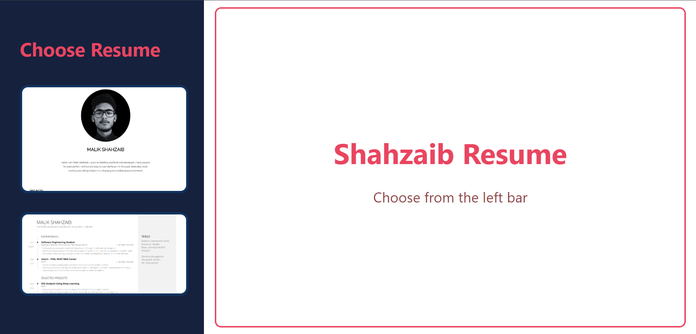

# Resume Viewer Web Application

A simple web application that allows users to view different resumes by selecting them from a side panel. The resumes are displayed on the same page using an embedded iframe.

## Features
- **Resume Selection**: Users can click on a resume preview in the left panel to load it in the main display area.
- **Responsive Design**: The layout adjusts automatically to different screen sizes using CSS Flexbox.
- **Embedded View**: Resumes are displayed within an iframe, ensuring a seamless viewing experience without reloading the page.

## Technologies Used
- **HTML**: Structure of the web pages, including the resume viewer and individual resume pages.
- **CSS**: Styling for layout, font, and positioning of elements using Flexbox.

## Files
1. **index.html** - The main page containing the resume viewer.
2. **select.html** - The default page shown in the iframe before any resume is selected.
3. **resume_1.html & resume_2.html** - Example resumes displayed when clicked.
4. **styles.css** - External CSS file used for styling (if applicable).

## Screenshot

## How to Run
1. Clone this repository.
2. Open `index.html` in any browser to start viewing resumes.
